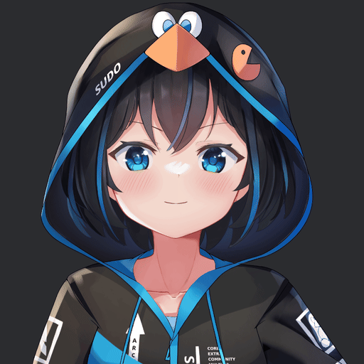

## ✦ Bevy Inochi2d

[](https://docs.rs/bevy_inochi2d/latest/bevy_inochi2d/)

Inochi2D renderer built on Bevy's native `Mesh2d`/`Material2d` ecosystem.



> **Note:** Puppet parts are regular `Mesh2d` entities - they interleave and
> depth-sort natively with plain Bevy sprites/meshes by Z, batch through
> Bevy's standard 2D render phases, and need no custom `ViewNode`. A
> previous version of this crate used a fully custom command-list renderer -
> see [Legacy renderer](#-legacy-renderer) below.

## ✦ Description

**bevy_inochi2d** loads .inr puppet files (and optionally .inx / .inp) and renders each part as a `Mesh2d` + `MeshMaterial2d`, specialized per blend mode. Masks are CPU polygon clipping (baked into the mesh, no stencil/render-target needed for the common case); composite groups collapse to a single Z-band when the "over" operator's associativity allows it, falling back to an offscreen render-target pass only for the rare composite that genuinely needs one (e.g. `Multiply` with overlapping children).

## ✦ Formats

| Format | Default | Notes |
| ------ | ------- | ----- |
| `.inr` | ✓ | Runtime format: flat pre-order node list, index cross-references, raw RGBA8 textures. Loads with **no image decoding and no UUID maps** via `inochi2d-parser`'s `inr` feature (`serde_json` + `bytemuck` only). |
| `.inx` / `.inp` | feature `inx` | Authoring formats. Parsed, then converted **in memory** into the same typed INR document + binary blob the exporter produces (`inochi2d_parser::inr::convert_puppet` - no JSON round-trip, no file written) and fed through the exact same conversion `.inr` files use. This is why `inx` needs `inr-export` on the parser: mask-contour baking and texture decoding only exist on that side, and going through the same INR-shaped path means the two loaders can't produce different results for the same puppet. |

Convert an authoring file to INR ahead of time with the parser's exporter
(run inside the [`inochi2d-parser`](https://github.com/Huskysis/inochi2d-parser)
repo) if you'd rather not pay the conversion cost at load time:

```sh
cargo run --features inr-export --example inx2inr -- "Arch Chan.inx" "Arch Chan.inr"
```

INR files are larger on disk than INX (textures are stored as raw RGBA8
instead of PNG). Loading `.inx`/`.inp` directly does the same PNG/TGA decode
and mask-contour baking at load time instead - same total RAM once loaded
(an `.inr` already stores decoded RGBA8, so there's no steady-state
difference), but a transient ~2x peak for that asset's textures *during*
the load (decoded buffer + the copy handed to Bevy's `Image`) that isn't
retained afterward. Loading the same path twice doesn't duplicate this:
Bevy's `AssetServer` dedupes by path, so `load()` (and this conversion)
only runs once per unique asset regardless of how many puppets reference it.

```toml
# INX/INP support is opt-in:
bevy_inochi2d = { version = "0.4", features = ["inx"] }
```

## ✦ Features

✦ **Asset loader**: Loads `.inr` files via Bevy's `AssetServer` (plus `.inx` / `.inp` with the `inx` feature): puppet tree, meshes, textures, parameters and animations.  
✦ **Native Mesh2d rendering**: Parts are `Mesh2d` + `MeshMaterial2d<InxPartMaterial>`, specialized per `BlendMode` - no custom `ViewNode`, no bypassing Bevy's render graph.  
✦ **Mask system**: CPU polygon clipping (`i_overlay`/`i_triangle`), baked into the part's mesh each frame it changes - no stencil buffer, no extra render target.  
✦ **Composite groups**: Z-band collapsing for the common "over" case (zero render-target cost); automatic fallback to an offscreen render-target pass (`NeedsRt`) only when a group's blend mode genuinely requires it. Supports real nesting (composite inside composite).  
✦ **Parameter system**: 2D grid interpolation (linear/cubic/stepped) for transform bindings and mesh deformations.  
✦ **Animation controller**: Multi-layer with crossfade, looping, pause/resume (freeze without resetting) and per-layer blend (additive/override); `stop_all()` resets untouched params to default.  
✦ **Simple physics**: Pendulum and spring-pendulum simulation feeding params (hair, accessories, etc); global (`PhysicsEnabled`) or per-puppet (`InxPuppetPhysicsEnabled`) on/off toggle.  
✦ **Scene spawn**: `InxScene` component to spawn a puppet automatically; `default_pose: true` resolves params to their authored defaults without needing `InxAnimationPlugin`'s full loop.  
✦ **Props (pseudo-sprites)**: `InxProp` attaches external textured quads to puppet nodes - a regular `Mesh2d`/`Sprite`, z-ordered between parts natively (e.g. an item in the hand).  
✦ **Render to texture**: Works with Bevy's standard `RenderTarget::Image` and `RenderLayers` - render a puppet offscreen and use the result anywhere (UI, sprites, 3D).  
✦ **MeshGroup deform**: child parts warp through the group's lattice, matching upstream's per-group `dynamic_deformation` (runtime re-warp vs rest-pose additive) and `propagateMeshGroup` (a non-propagating Composite acts as a warp barrier).

## ✦ Usage example

```toml
[dependencies]
bevy_inochi2d = "0.4"
```

```rust
use bevy::prelude::*;
use bevy_inochi2d::prelude::*;

fn main() {
    App::new()
        .add_plugins(DefaultPlugins)
        .add_plugins(Inochi2dPlugin)
        .add_plugins(Inochi2dAnimationPlugin)
        .add_systems(Startup, setup)
        .run();
}

fn setup(mut commands: Commands, asset_server: Res<AssetServer>) {
    commands.spawn(Camera2d);

    let puppet: Handle<InxPuppet> = asset_server.load("my_puppet.inr");
    commands.spawn(InxScene {
        puppet,
        transform: Transform::from_scale(Vec3::splat(0.5)),
        animation: true,
        default_pose: false,
    });
}
```

## ✦ Legacy renderer

An earlier version of this crate rendered puppets through a fully custom
`ViewNode` (`DrawPart`, `BeginComposite`/`EndComposite`, `PushMask`/`PopMask`
command list, stencil-based masks, render-target composites) that bypassed
Bevy's standard 2D render phases entirely - the reasoning at the time was
that Inochi2D's strict z-sort/composite/mask stack didn't fit
`RenderPhase`'s sort-key batching model.

That approach worked, but Bevy sprites/meshes couldn't interleave or
depth-sort with puppet parts (the puppet rendered as one opaque layer, after
`Node2d::MainPass`) - solving that meant either bypassing more of Bevy's
ecosystem, or reworking masks/composites into a form Bevy's own phases could
carry. This crate now does the latter (CPU-clipped masks baked into the
mesh, Z-band composites, `Mesh2d`/`Material2d` parts - the same approach as
`bevy_spine`): full native interleaving, batching, and standard render-to-
texture, at the cost of an offscreen pass for the rare composite that can't
collapse to a Z-band.

The old `ViewNode` renderer was retired with the 0.4.0 release (it shipped
in 0.3.x).

## Compatibility

| bevy_inochi2d | Bevy | Renderer |
| ------------- | ---- | -------- |
| 0.4           | 0.18 | Native `Mesh2d`/`Material2d` (this branch) |

**Note:** Since Bevy 0.18 the `2d` feature collection officially supports bringing your own 2D renderer, which is exactly what this plugin does.

### Legacy releases (0.1-0.3)

| bevy_inochi2d | Bevy |
| ------------- | ---- |
| 0.3           | 0.18 |
| 0.2           | 0.17 |
| 0.1           | 0.17 |

These versions used a fully custom `ViewNode` renderer instead of `Mesh2d`/`Material2d` - see [Legacy renderer](#-legacy-renderer) above. No longer maintained.

## ✦ Dependencies

- [`inochi2d-parser`](https://github.com/Huskysis/inochi2d-parser) (feature `inr`): INR container reading and typed document.
- `bytemuck`: Struct to bytes conversion (or GPU buffer).
- `bevy`: Windowing, asset system, ECS, easy access to wgpu.
- With feature `inx` only: `inochi2d-parser` (feature `inr-export`) - parses INX/INP authoring JSON and converts it in memory to the INR shape (texture decode, mask-contour baking).

## ✦ Props: attaching external content

A puppet is not a closed quad: parent an `InxProp` to any puppet node and it renders
as a regular `Mesh2d`, z-sorted between puppet parts by Bevy's own depth-sort - no
special-casing needed, same mechanism a plain `Sprite` would use to sit above/below
the whole puppet.

```rust
// find a node entity (e.g. by Name), then:
commands.entity(hand).with_child((
    InxProp {
        texture: asset_server.load("sword.png"),
        size: Vec2::new(64.0, 200.0),
        ..Default::default()
    },
    InxZSort(-0.05), // lower zsort = in front of the hand
));
```

See `examples/prop.rs` for a runnable demo (attach/remove at runtime).

## ✦ Render to texture

The pipeline renders per view, so Bevy's standard render-to-texture just works:
point a camera at an `Image` asset with `RenderTarget::Image` and put the puppet on
a dedicated `RenderLayers` layer so only that camera draws it. `RenderLayers` can be
set directly on the `InxScene` command (it is propagated to the puppet root).

```rust
// Offscreen camera draws layer 1 into `image_handle`.
commands.spawn((
    Camera2d,
    Camera { order: -1, ..Default::default() },
    RenderTarget::Image(image_handle.clone().into()),
    RenderLayers::layer(1),
));

// Puppet visible only to that camera.
commands.spawn((
    InxScene { puppet, transform, animation: true, default_pose: false },
    RenderLayers::layer(1),
));
```

The resulting texture is a regular `Handle<Image>`: use it in UI (`ImageNode`),
as a `Sprite`, on a 3D mesh, etc. Typical uses:

- Dialog portraits / HUD avatars (`ImageNode`).
- Character select screens, in-game screens and mirrors.
- 3D billboards (puppet on a quad in a 3D world).
- Per-puppet post-processing (outline, hit-flash) on the texture.
- Rendering at a resolution decoupled from the window; thumbnails.

Notes: the target image must be `Rgba8UnormSrgb` with
`RENDER_ATTACHMENT | TEXTURE_BINDING` usage, and the offscreen camera must stay
LDR (no `Hdr` component). See `examples/rtt.rs` for a runnable demo.

## ✦ Examples

Run with `cargo run --example <name>`. All examples load the Arch Chan puppet shipped in `assets/`.


| Example | Demonstrates |
| ------- | ------------ |
| `basic.rs` | Spawns one puppet, plays a named animation with crossfade/loop, pause/resume (freeze without reset) and stop (reset to default), toggles per-puppet physics. |
| `prop.rs` | Attaches external content (`InxProp`) to a specific puppet node - follows that node's own animated/physics transform. |
| `rtt.rs` | Renders a puppet offscreen into an `Image`, reused as a `Sprite` and a UI `ImageNode`. |
| `mesh2d.rs` | Plain-`Sprite` Z-interleaving with puppet parts, per-composite render-target dumps, physics toggle. |

**`InxProp` vs. a plain Bevy sprite:** both interleave with puppet parts by Z
automatically (parts are regular `Mesh2d` entities, Bevy depth-sorts everyone
together) - that part isn't `InxProp`-specific. Use `InxProp` when the content
must *attach to and follow* a puppet node (parented, tracks its
animated/physics transform, e.g. a sword following a hand); for an object
that's just placed at some Z independently of any node, a plain
`Sprite`/`Mesh2d` is enough - see `mesh2d.rs`'s `ZMarker` for exactly that,
with no `InxProp` at all.

## ✦ Known limitations

- [ ] Complex blend modes (`ColorBurn`, `HardLight`, `SoftLight`, `Difference`,
      `Exclusion`, `Inverse`) fall back to `Normal` - need a shader/multi-pass
      to implement accurately.
- [ ] `mask_threshold` (alpha-based mask cutoff) is not read - masks are
      pure geometry clipping.
- [ ] `InxNodeType::Camera` nodes are parsed but have no runtime effect
      (editor framing only: INP exports drop them entirely).

## ✦ Example Asset

The example Puppet (Arch Chan.inx) was obtained from the [arch-chan](https://github.com/Speykious/arch-chan) repository under the CC0 1.0 Universal license.
